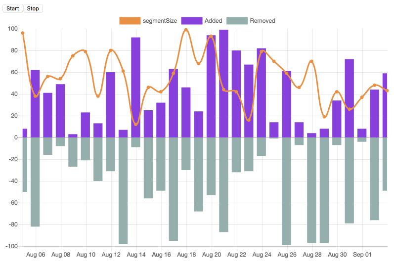

Chart supports rendering real-time data using mock data.
======



How to build and start
----------------
Please use Node.js 8.

```bash
nvm use
npm install
npm run build
```

Run tests

```bash
npm run test
```

Start the server. Server will start on http://localhost:3000

```bash
npm start
```
